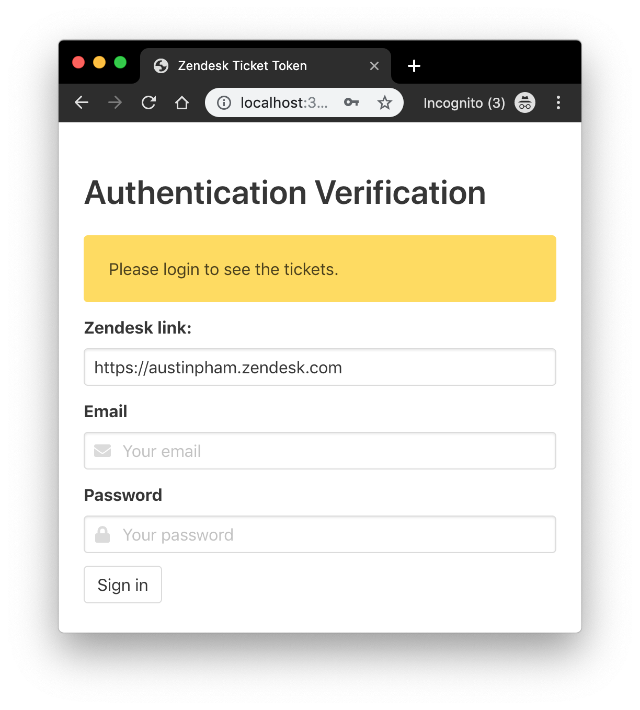
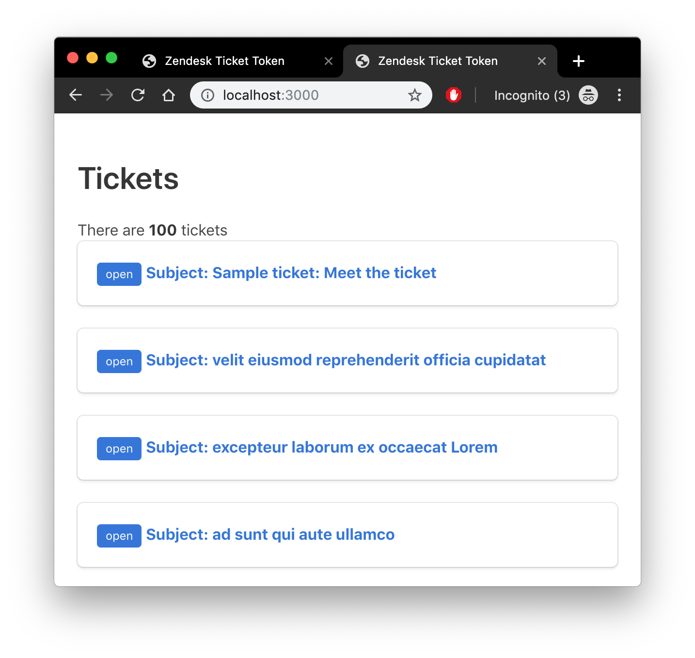
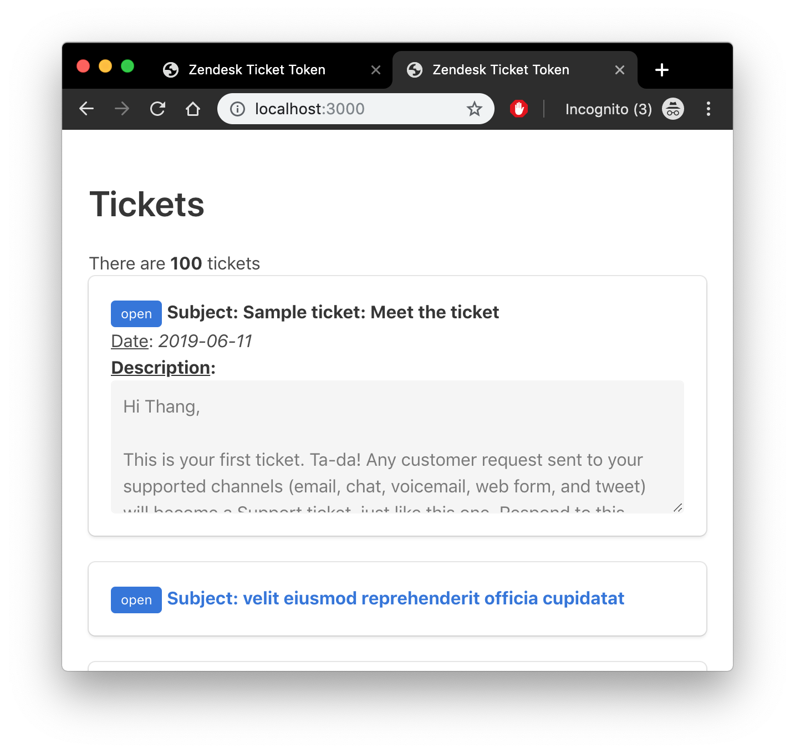

# Web-based ticket-viewer for zendesk

### To run

1. Install all of the dependencies

   ```bash
   npm install
   ```

2. Run the webpage.

   ```bash
   node server
   ```

The webpage is then hosted on `localhost:3000`

### To use



First, you need to sign-in to a Zendesk database.

By default it’s my zendesk link at `https://austinpham.zendesk.com`, please replace to yours.

Once logged in



Click on the title of the message you want to view to open it. 



Click on the title again to close it


